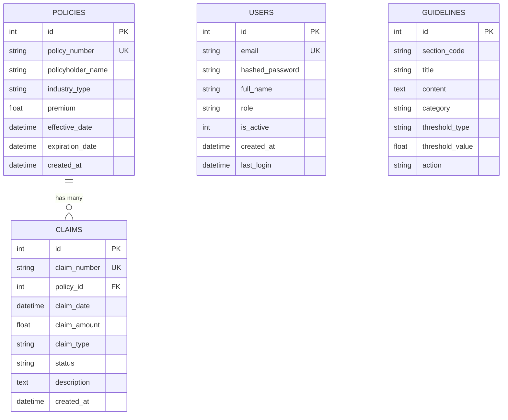

# RiskMind — Data Model Reference

**Version:** 2.0  
**Database:** SQLite (`backend/data/riskmind.db`)  
**ORM:** SQLAlchemy (async)  
**Schema File:** `backend/models/schemas.py`

---

## Entity Relationship Diagram



---

## Table Details

### 1. `users` — Authentication & Authorization

| Column | Type | Constraints | Description |
|--------|------|-------------|-------------|
| `id` | INTEGER | PK, auto-increment | Unique user ID |
| `email` | VARCHAR(255) | UNIQUE, NOT NULL | Login email |
| `hashed_password` | VARCHAR(255) | NOT NULL | bcrypt-hashed password |
| `full_name` | VARCHAR(200) | NOT NULL | Display name |
| `role` | VARCHAR(50) | DEFAULT 'underwriter' | `underwriter`, `senior_underwriter`, or `admin` |
| `is_active` | INTEGER | DEFAULT 1 | 1 = active, 0 = deactivated |
| `created_at` | DATETIME | DEFAULT now | Account creation timestamp |
| `last_login` | DATETIME | NULLABLE | Last successful login |

**Roles:**
- `underwriter` — Can view policies, run analysis, use chat
- `senior_underwriter` — Can approve/decline, generate memos
- `admin` — Full access, manage users

---

### 2. `policies` — Insurance Policies

| Column | Type | Constraints | Description |
|--------|------|-------------|-------------|
| `id` | INTEGER | PK, auto-increment | Internal ID |
| `policy_number` | VARCHAR(50) | UNIQUE, indexed | Business key (e.g., `COMM-2024-001`) |
| `policyholder_name` | VARCHAR(200) | | Company or individual name |
| `industry_type` | VARCHAR(100) | | Business sector (Manufacturing, Restaurant, etc.) |
| `premium` | FLOAT | | Annual premium in USD |
| `effective_date` | DATETIME | | Policy start date |
| `expiration_date` | DATETIME | | Policy end date |
| `created_at` | DATETIME | DEFAULT now | Record creation time |

**Current Data:** 20 policies across 10 industries.

---

### 3. `claims` — Insurance Claims

| Column | Type | Constraints | Description |
|--------|------|-------------|-------------|
| `id` | INTEGER | PK, auto-increment | Internal ID |
| `claim_number` | VARCHAR(50) | UNIQUE, indexed | Business key (e.g., `CLM-2024-001`) |
| `policy_id` | INTEGER | FK → policies.id | Links claim to parent policy |
| `claim_date` | DATETIME | | Date claim was filed |
| `claim_amount` | FLOAT | | Dollar amount of the claim |
| `claim_type` | VARCHAR(100) | | Category: `property_damage`, `bodily_injury`, `liability`, etc. |
| `status` | VARCHAR(50) | | `open`, `closed`, or `review` |
| `description` | TEXT | | Free-text description |
| `created_at` | DATETIME | DEFAULT now | Record creation time |

**Current Data:** 51 claims linked to the 20 policies.

---

### 4. `guidelines` — Underwriting Rules

| Column | Type | Constraints | Description |
|--------|------|-------------|-------------|
| `id` | INTEGER | PK, auto-increment | Internal ID |
| `section_code` | VARCHAR(50) | indexed | Rule identifier (e.g., `3.1.1`) |
| `title` | VARCHAR(200) | | Human-readable rule name |
| `content` | TEXT | | Full rule text |
| `category` | VARCHAR(100) | | `eligibility`, `frequency`, `severity`, `pricing`, `coverage`, `authority` |
| `threshold_type` | VARCHAR(50) | | What it measures: `count`, `amount`, `ratio` |
| `threshold_value` | FLOAT | NULLABLE | Trigger number (e.g., 4 claims, $100K, 65% ratio) |
| `action` | VARCHAR(100) | | What to do when triggered: `review`, `refer`, `decline` |

**Current Data:** 15 guidelines across 6 categories.

---

## Key Business Logic

### Loss Ratio Calculation
```
loss_ratio = (total_claims_amount / premium) × 100
```
- Below 50% → **Low Risk** (green)
- 50–80% → **Medium Risk** (yellow)
- Above 80% → **High Risk** (red)

### Alert Generation Rules
The `/api/alerts` endpoint scans all policies and generates alerts when:
1. **High Frequency** — Policy has 4+ claims → guideline `§3.1.1`
2. **Severity** — Any single claim > $100,000 → guideline `§4.3.2`
3. **Loss Ratio** — Ratio exceeds 65% → guideline `§5.1.2`
4. **Renewal** — Policy expiring within 90 days needs review

### Glass Box Explainability
Every AI decision shows:
1. **SQL Query** — The exact database query that was run
2. **Data Returned** — The numbers the AI used
3. **Guideline Citation** — Which rule section drove the decision

---

## How to Access the Database

```bash
# From backend directory
python -c "import sqlite3; conn = sqlite3.connect('data/riskmind.db'); print([t[0] for t in conn.execute('SELECT name FROM sqlite_master WHERE type=\"table\"').fetchall()])"
```

**File Location:** `backend/data/riskmind.db`  
**Schema Source:** `backend/models/schemas.py`  
**Seed Script:** `backend/seed_data.py`
